# BiscMarket Frontend

React/Redux frontend for a real-time cryptocurrency trading platform.

## 🚀 Live Demo

[View Live Application](https://your-frontend-link.com)

## 🔗 Backend Repository

The backend API for this project is located at:  
[biscmarket-backend](https://github.com/yourusername/biscmarket-backend)

## 📸 Screenshots

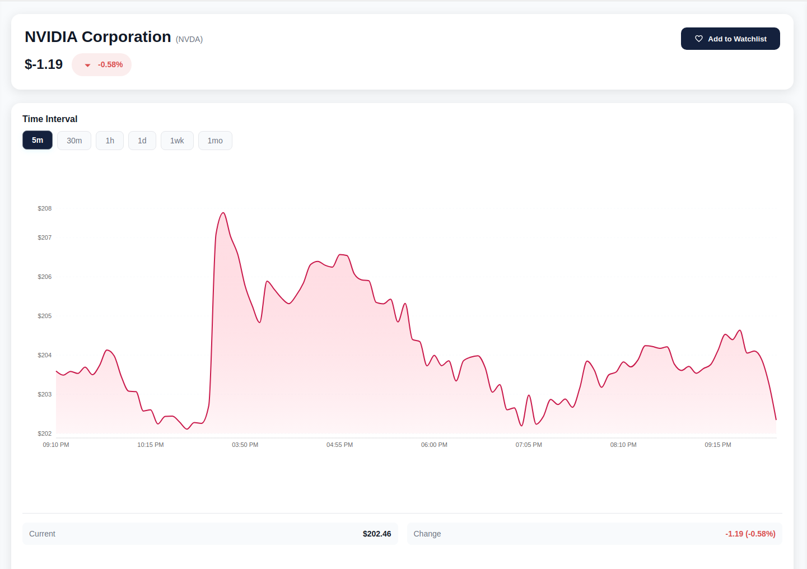
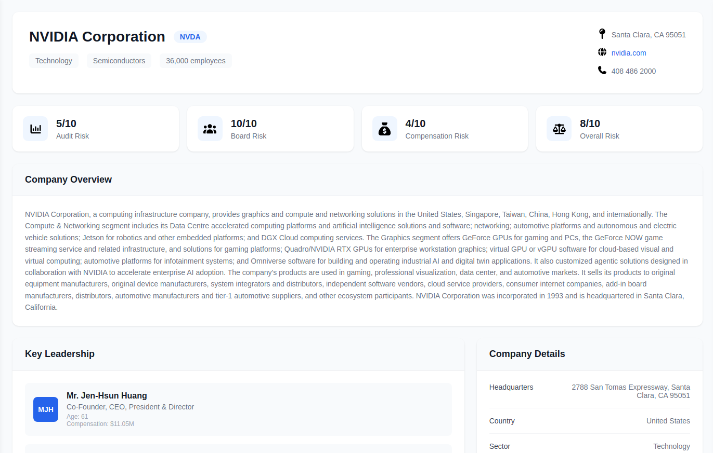
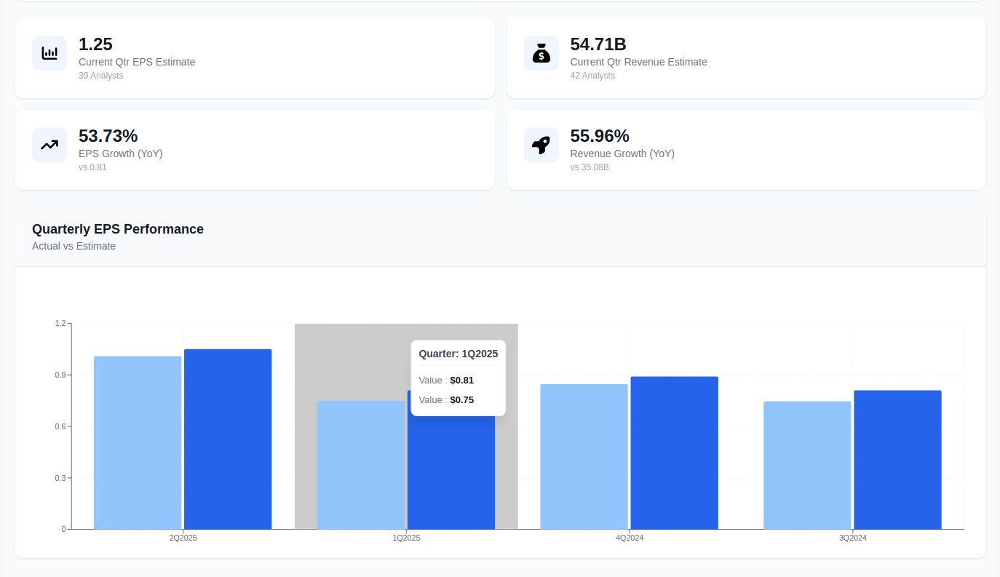

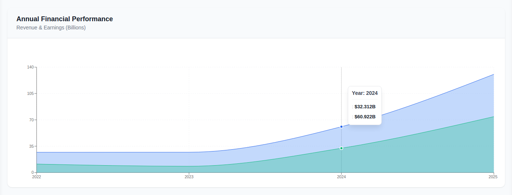
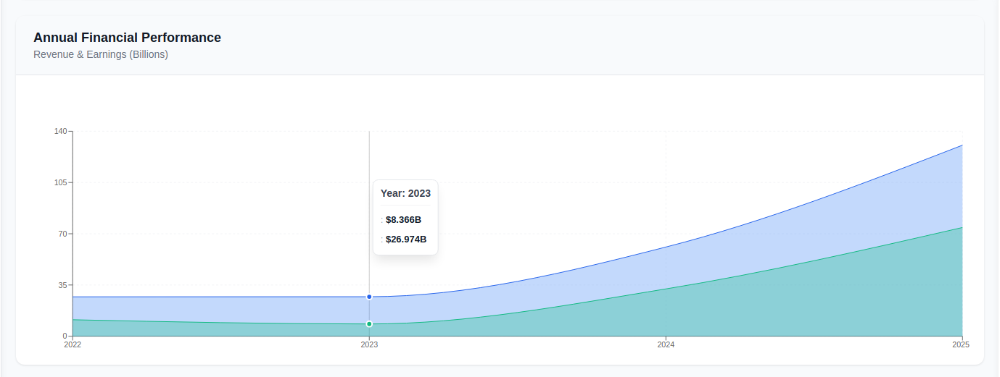
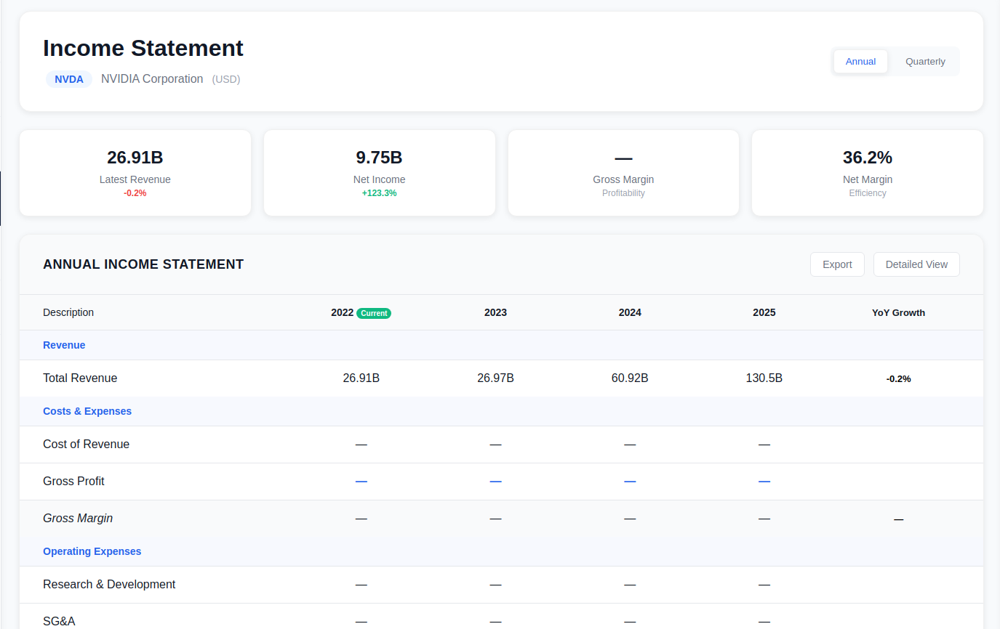
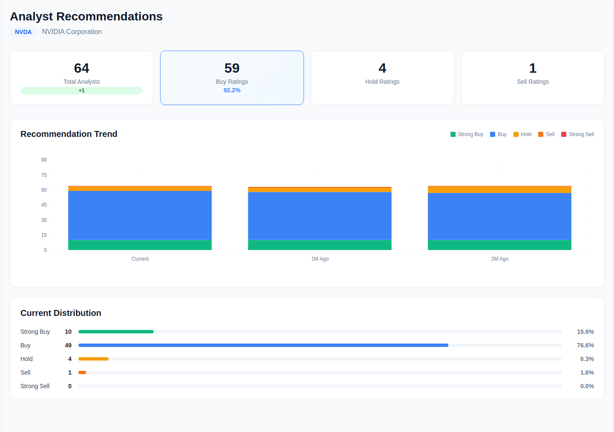
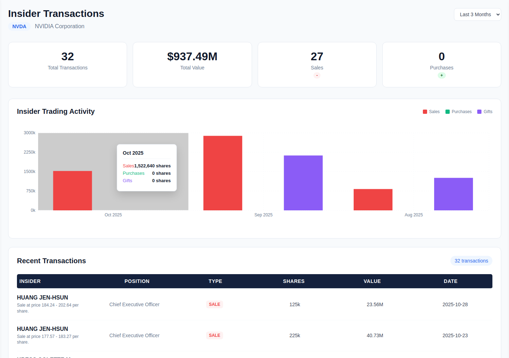

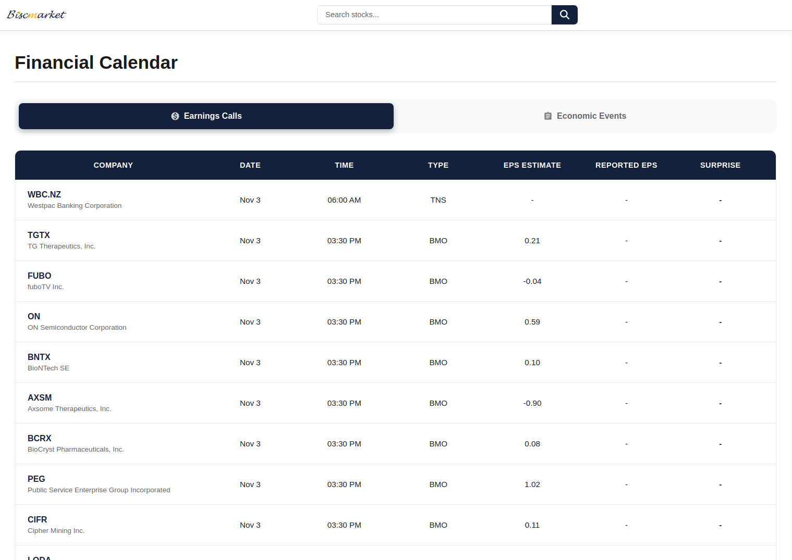
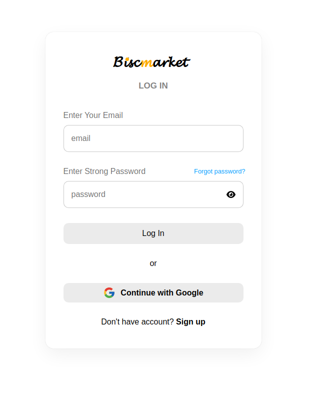
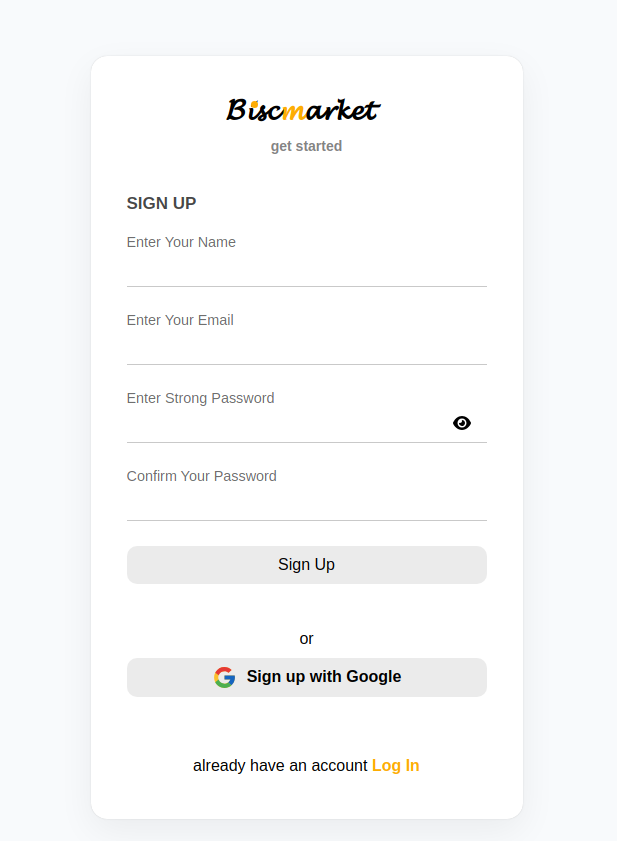

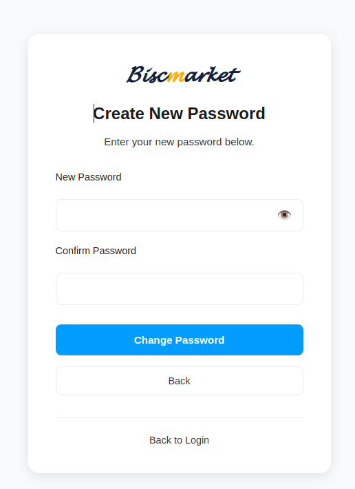

## 🛠️ Tech Stack

### Frontend Technologies

- **React** - Component-based UI framework
- **Redux** - State management for complex application state
- **JavaScript (ES6+)** - Core programming language
- **SASS** - Advanced CSS with variables and mixins
- **HTML5** - Markup structure
- **Chart.js** - Real-time price charts
- **Axios** - HTTP client for API communication

### Key Features Implemented

- Real-time market data dashboard
- Interactive trading interface
- Portfolio management with profit/loss calculations
- Responsive design for all devices
- JWT authentication flow
- Dynamic price charts and graphs

## 🚦 Local Development Setup

### Prerequisites

- Node.js (v14 or higher)
- npm or yarn
